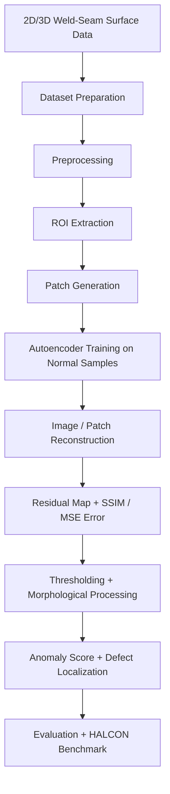
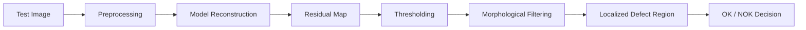
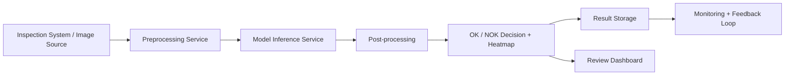

# Weld-seam-anomaly-detection-methodology

**Methodology & Results Documentation**  
*Unsupervised anomaly detection and localization on industrial 2D/3D welding seam surface data*

> ⚠️ **NDA Notice**  
> This project was completed at **Automation W+R GmbH, Munich** as part of my Master's thesis at **Technische Hochschule Rosenheim**.  
> The original source code, proprietary sensor data, internal tools, and company-specific implementation details cannot be shared.  
> This repository documents the **problem, methodology, architecture, evaluation approach, results, limitations, and deployment-oriented thinking** for portfolio and discussion purposes.

---

## Project Overview

Industrial welding seam inspection is a challenging quality-control task because many defects are small, rare, and visually similar to normal surface variations. Existing supervised or rule-based inspection approaches can perform well, but they often require labelled defect data, manual configuration, and adaptation for every new seam geometry or production setup.

The goal of this thesis was to investigate whether an **unsupervised deep learning approach** could detect and localize welding seam surface defects without requiring labelled defect examples during training.

I developed and evaluated a reconstruction-based computer vision pipeline using **autoencoders and classical image processing**. The workflow covered dataset preparation, preprocessing, model training, inference, residual-map generation, defect localization, evaluation, and benchmarking against an industrial **HALCON** baseline.

The best-performing approach achieved an **AUROC of 0.966** on the main evaluation case.

---

## Why This Project Matters

In industrial inspection, detecting whether a part is defective is not enough. The system also needs to show **where** the defect is located so that engineers or operators can understand the issue and take action.

This project focused on both:

- **Anomaly detection** — identifying whether a weld-seam sample is normal or defective
- **Anomaly localization** — highlighting the suspicious region on the surface image

The work explored how unsupervised learning can reduce dependency on manual defect labelling while still supporting practical quality inspection requirements.

---

## My Ownership

I was responsible for the full research and engineering workflow:

- Converted industrial 2D/3D weld-seam height-map data into model-ready image datasets
- Prepared training, validation, and test datasets from multiple welding seam segments
- Designed preprocessing workflows for ROI extraction, grayscale conversion, resizing, normalization, and augmentation
- Implemented and compared multiple autoencoder-based anomaly detection approaches
- Built the inference workflow for reconstruction, residual-map computation, anomaly scoring, and defect localization
- Evaluated model performance using AUROC, precision, recall, F1-score, accuracy, SSIM, MSE, and confusion matrices
- Benchmarked the results against an industrial HALCON-based inspection baseline
- Analyzed false positives, false negatives, localization quality, and failure cases
- Documented technical trade-offs, model behavior, limitations, and future improvement areas

---

## Industrial Problem

The inspection task involved surface defects on welding seams. Examples of relevant defect types included:

- burn-through
- porosity
- seam interruption
- excess silicate
- incorrectly recognized seams due to sensor or scanning issues

The challenge was that these defects could be subtle and visually close to normal weld splatter or surface texture. This made the problem difficult for both classical rule-based image processing and supervised learning approaches.

The key limitation of supervised inspection in this context was the need for labelled defect data. Since defects are rare and labelling is expensive, an unsupervised approach was explored.

---

## Dataset Context

The original dataset is proprietary and cannot be shared.

High-level dataset characteristics:

- Around **8,000 real industrial welding seam samples**
- 2D bitmap height-map images derived from 3D surface data
- Data captured using triangulation/profile sensor technology
- Samples collected from multiple welding seam segments
- Strong class imbalance, as defective samples were rare
- Dataset required preprocessing and careful selection of clean normal samples for training

The input data was not a ready-made public dataset. A significant part of the work involved transforming raw industrial inspection data into a structured dataset suitable for training, validation, testing, and benchmarking.

---

## Methodology

The project followed a reconstruction-based unsupervised anomaly detection strategy.

The core assumption was:

> A model trained only on normal weld-seam surfaces should reconstruct normal regions well, while defective regions should produce higher reconstruction errors.

The pipeline consisted of the following stages:

---
## Preprocessing Pipeline

The preprocessing stage was important because the raw industrial surface data contained irrelevant background regions, noise, and variation between welding seam segments.

The goal of preprocessing was to make the input images consistent before training and inference.

Key preprocessing steps included:

- Region of Interest extraction
- grayscale conversion
- resizing
- normalization
- data augmentation
- edge and contour-based processing
- patch extraction for localized training and inference

Main tools and methods:

`Python` `OpenCV` `NumPy` `ROI extraction` `thresholding` `contour analysis` `morphological operations`

## Model Development

I tested multiple reconstruction-based approaches instead of relying on a single model design. The goal was to understand which architecture and training strategy worked best for both anomaly detection and localization.

### Trial 1 — Autoencoder with Skip Connections

This model was designed to preserve spatial information during reconstruction. Skip connections were used to support better reconstruction quality and retain localized surface details.

### Trial 2 — Pre-trained Encoder with Autoencoder Decoder

This trial explored whether a pre-trained encoder could improve feature representation and reconstruction behavior compared to a fully custom architecture.

### Trial 3 — Patch-Based Autoencoder

This approach trained the model on randomly cropped patches. The goal was to improve localized reconstruction and make defect localization more precise.

Patch-based inference was especially important because industrial inspection requires more than image-level classification. The system also needs to identify the location of suspicious regions.

## Inference and Localization

The inference workflow was designed to move from reconstruction output to inspection-relevant defect localization.

The inference process included:

1. loading the trained model
2. reconstructing test images or image patches
3. computing residual maps from input and reconstruction
4. calculating image-level anomaly scores
5. applying thresholding to highlight abnormal regions
6. using morphological operations to reduce noise and refine defect regions
7. generating localized anomaly outputs
8. evaluating detection and localization performance

Simplified inference logic:

---

## Evaluation Strategy

The evaluation was designed to answer three practical questions:

1. Can the model separate normal and defective weld-seam samples?
2. Can the model localize suspicious regions on the surface image?
3. How does the developed approach compare with an existing industrial HALCON-based inspection baseline?

Metrics used:

| Metric | Purpose |
|---|---|
| AUROC | Measures separation between normal and anomalous samples |
| Precision | Measures reliability of predicted anomalies |
| Recall | Measures ability to detect actual anomalies |
| F1-score | Balances precision and recall |
| Accuracy | Measures overall classification correctness |
| Confusion Matrix | Helps analyze false positives and false negatives |
| SSIM | Measures structural similarity between input and reconstruction |
| MSE | Measures pixel-level reconstruction error |

The evaluation was not limited to one final score. I also analyzed reconstruction quality, residual maps, localized defect regions, and failure cases to understand whether the approach could be useful in a real inspection setting.

---

## Results Summary

The best-performing setup achieved:

| Result | Value |
|---|---|
| Main evaluation AUROC | **0.966** |
| Benchmark reference | Industrial HALCON-based baseline |
| Task | Unsupervised anomaly detection and localization |
| Data type | 2D/3D weld-seam surface data |

The result showed that the developed deep learning approach had strong potential for reducing dependency on labelled defect data while supporting automated quality inspection.

A second seam type with similar characteristics also showed strong performance:

| Metric | Value |
|---|---|
| AUROC | 0.94 |
| Precision | 0.875 |
| Recall | 0.933 |
| F1-score | 0.903 |
| Accuracy | 0.90 |

Performance was weaker for seam types where clean normal samples were limited or where weld splatter patterns closely resembled defect regions. This became an important part of the failure analysis and helped define the next improvement steps.

---

## Failure Analysis

A major part of the project was understanding why the model failed, not only where it performed well.

Observed challenges included:

- false positives caused by strong surface texture or lighting variation
- reduced localization quality near image boundaries
- sensitivity to patch size and stride during sliding-window inference
- difficulty separating excess weld splatter from normal seam texture
- weaker generalization when clean non-defective samples were limited
- threshold sensitivity across different seam geometries

This failure analysis helped identify the conditions under which the approach was reliable and where additional engineering work would be required before production rollout.

---

## Deployment-Oriented Thinking

Although the thesis was research-focused, I planned the pipeline with production-readiness in mind.

A deployment-oriented version of the system would include:

---
Planned production workflow:

- Dockerized preprocessing and inference modules
- REST API endpoint for prediction requests
- AWS EC2/S3 or an on-premise GPU workstation for inference and result storage
- Git/GitHub Actions for version control, testing, and container build workflows
- Python-based logging for inference time, anomaly scores, and failed predictions
- Monitoring of false positives, threshold drift, and recurring surface artifacts
- Feedback loop for reviewed samples to improve future model versions

This design would allow the research prototype to move toward a maintainable computer vision inference service for industrial inspection.

---

## Technical Stack

| Area | Tools / Methods |
|---|---|
| Programming | Python |
| Computer Vision | OpenCV, NumPy, contour analysis, thresholding, morphology |
| Deep Learning | TensorFlow / Keras, autoencoders, reconstruction learning |
| Evaluation | AUROC, precision, recall, F1-score, accuracy, SSIM, MSE, confusion matrices |
| Benchmarking | HALCON baseline comparison |
| Reproducibility | structured scripts, experiment documentation |
| Deployment Planning | Docker, AWS EC2/S3, REST API concepts, Git/GitHub Actions, logging |

---

## Skills Demonstrated

This project demonstrates practical experience in:

- industrial computer vision
- unsupervised anomaly detection
- autoencoder-based reconstruction learning
- 2D/3D surface data preprocessing
- ROI extraction and patch-based inference
- residual-map generation
- defect localization
- classical image processing with OpenCV
- model evaluation and benchmarking
- failure-case analysis
- experiment documentation
- deployment-oriented ML system design

---

## What I Would Improve Next

If I were extending this work further, I would explore:

- normalizing-flow-based anomaly detection methods such as FastFlow
- student-teacher anomaly detection approaches
- stronger threshold calibration using limited expert feedback
- active learning or pseudo-labelling for uncertain cases
- explainability methods for production operator trust
- a lightweight FastAPI inference service
- Dockerized local demo using synthetic or public surface-defect data
- monitoring dashboard for anomaly scores and false-positive review

---

## Repository Purpose

This repository is not intended to reproduce the proprietary company project directly.

Instead, it demonstrates:

- how I structured an industrial anomaly detection problem
- how I transformed raw inspection data into a machine learning workflow
- how I designed and compared reconstruction-based approaches
- how I evaluated detection and localization performance
- how I analyzed model limitations and failure cases
- how I planned a path from research prototype to production-ready inference service

---

## Thesis Information

**Title:**  
*Anomaly Detection of 3D Surface Defects*

**Institution:**  
Technische Hochschule Rosenheim

**Industry Partner:**  
Automation W+R GmbH, Munich

---

## Author

**Pranav Chavan**  
Applied AI / Computer Vision Engineer  
Rosenheim, Germany

[LinkedIn](https://linkedin.com/in/pranav-chavan-) · [GitHub](https://github.com/Pranavc25)
